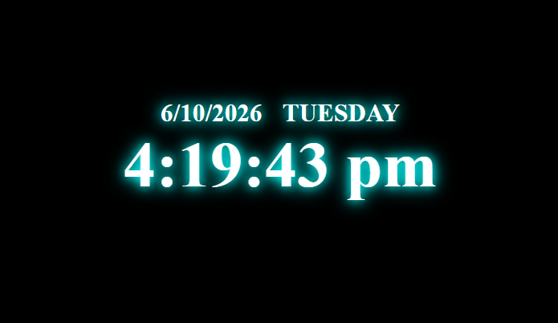

# Digital Clock

A real-time digital clock web app with a neon-glow dark theme. It shows the current time, date and weekday, updating every second without a page reload.

**[Live Demo](https://shamitha-2330.github.io/digital-clock/)**



## Features

- Live time in 12-hour format with AM/PM indicator
- Current date and weekday display
- Updates every second using `setInterval()`
- Neon glow effect using CSS `text-shadow`
- Dark theme with centered layout

## Tech Stack

- **HTML5**: page structure
- **CSS3**: styling and glow effect
- **JavaScript (ES6)**: `Date` object, DOM manipulation, `setInterval()`

## Project Structure

```
digital-clock/
├── index.html
├── style.css
├── script.js
├── scrnshot.png
└── README.md
```

## Run Locally

```bash
git clone https://github.com/Shamitha-2330/digital-clock.git
cd digital-clock
```

Then open `index.html` in any browser. No installation or build step needed.

## How It Works

1. `script.js` creates a `Date` object to read the current time, date and day.
2. The values are formatted into a 12-hour time string and written to the page through the DOM.
3. `setInterval()` repeats this every 1000 ms, so the clock stays in sync.

## Future Improvements

- 12/24-hour format toggle
- Alarm feature
- Theme color switcher

## Author

**Shamitha**
